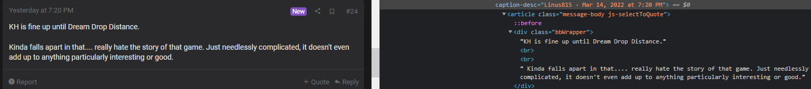

```{r setup, include=FALSE}
knitr::opts_chunk$set(echo = TRUE)
```


```{r logo_set_1, echo = FALSE, fig.align='center'}

```


```{r logo_set_2, echo = FALSE, fig.align='center', fig.cap='Source: Wikimedia Commons'}

```


# Background

In this article we try to measure the public opinion towards the Epic Games Store using posts scrapped from the Resetera forums. We'll analyze a dataset that we obtained using web scrapping techniques from the rvest package at www.resetera.com, and then go through the common data science pipeline (importing, cleaning and exploring) in order to check if the general opinion towards the known digital game store has somewhat improved.

# Introduction

Epic Games is a well-known american video game company that was founded 31 years ago. While it achieved important milestones in the past such as the development of the Unreal Engine or some famous franchises (_Unreal Tournament_, _Gears of War_, etc...), the company is now recognized as the developers of _Fortnite_, arguably the most popular game in the world these years, having around [3 million online players](https://playercounter.com/fortnite/) at the time of the writing of this article. Riding on its success, Epic diversified its portfolio with the opening of a brand new digital game store on December 4th, 2018, called the _Epic Games Store_ (EGS), directly competing with other stores such as Steam, Origin or GOG. One of the features from the EGS that puts it apart from the competition is the fact that they gift one or more videogames each week, and while this is indeed a very generous offer, a lot of gamers thought of this move as if they were "buying users", like an excuse for the lack of crucial services that in 2018 were (and still are) deemed essential for any digital store in the industry, such as a shopping cart, cloud saving, more payment options, community options, better navigability... and many other features. Epic responded to this [showing a roadmap](https://trello.com/b/GXLc34hk/epic-games-store-roadmap) for currently in-development and future planned features.

After four years of improvements and the expanding of their game catalogue, the question that we want to answer is: Has the public opinion on the EGS gone better or worse as of 2022? In order to answer the proposed question, we'll be using sentiment analysis with posts obtained through web scrapping from the Resetera forums, one of the most popular videogame forums on the internet. As a user of the forums myself, I know that the opinion about the EGS on the forum wasn't quite good around its launch period, to say the least, so I'm really interested if it's been shifted in this regard towards one way or the other. The sentiment analysis will be employed using the sentiment lexicon from (Nielsen, 2011), which numerically scores different words from -5 (most negative) to 5 (most positive). Gauging the general opinion from any thread would consist of summing all the scores from the identified words and checking if the total sum is above or below zero, evaluating the general sentiment as positive or negative, respectively. Sentiment analysis using the AFINN lexicon is by no means to be exhaustive (that is, we are not making any judgement in basis of modelling or statistical inference), but can shed some light in the general perception of any kind of subject.

# Preparing data and packages


```{r importing, message=FALSE, warning=FALSE}
## Installing necessary packages
install.packages(c("pracma", "polite", "tidytext",
                   "wordcloud", "rebus", "textdata",
                   "stopwords"))

## Importing packages
library(tidyverse)
library(tidytext)
library(wordcloud)
library(rvest)
library(reshape2)
library(polite)
library(stringr)
library(rebus)
library(lubridate)
library(xts)
library(infer)
library(parallel)
library(parallelly)
library(pracma)
library(knitr)
library(kableExtra)

## Loading our own functions
source(file.path("input", "ReseteraFunctions.R"), encoding = "utf-8")

## Importing the datasets
rst_thread_df_raw <- read_csv(file.path("data", "rst_thread_df_raw.csv"))
sentiments <- read_csv(file.path("data", "afinn.csv"))

## Setting the plot theme
rst_palette <- c("#7847B5", "#8952CD", "#FEF9FE", "#9F75DB", "#8B70B4")

theme_set(
  theme(panel.background = element_rect(fill = rst_palette[3]),
        panel.grid.major.x = element_line(colour = rst_palette[5]),
        panel.grid.major.y = element_blank())
)


```

# Web scrapping using rvest

Our objective through the use of web scrapping is to have a data frame where we store different posts and other features related it. We are going to use the _rvest_ package by Hadley Wickham, which is an useful package for this purpose and includes nice tidy syntax in its functions. The code in this section won't be evaluated because of time constraints (importing all the pertinent info lasts around 24 minutes), but will be shown here regardless. The actual dataset has been saved already in csv format and will be imported like usual through a readr package function.

First of all, we'll identify all Resetera threads that are about the Epic Games Store. The method for this will be using the google search engine with the following query: _resetera epic games store site:www.resetera.com_

```{r web_scraping_1, eval = FALSE}
## Connecting to Google ====

# We intend to extract resetera urls through Google, at least for 10 different
# search pages

## Base url
ggle_rst_base <- "https://www.google.com/search?q=resetera+epic+games+store+site:www.resetera.com&"
```

Because google usually returns not one, but multiple pages with possible results, we decide to make a list of different versions of the main url contained in the variable _ggle_rst_base_ to check for every possible page:

```{r web_scraping_2, eval = FALSE}
## Then, we create a list for 10 search pages adding a pattern to ggle_rst_base
ggle_rst_urls <- paste0(ggle_rst_base, "start=", seq(0, 90, by = 10), "&")

head(ggle_rst_urls)

# Let's save google xmls in a list
ggle_cookies_list <- map(ggle_rst_urls, read_html)

head(ggle_cookies_list, 2)
```

If we need to accept cookies (which we don't here on the DataCamp workspace, but I had to anyway when working on my desktop), we have to use the following code, in order to query the actual search results. We plan for this using the _html_form_submit()_ function, which by default chooses an "Accept" button anywhere on the webpage. Then, we read the htmls of the google pages:

```{r web_scraping_3, eval = FALSE}
# We need to get past cookies
ggle_xml_list <- ggle_cookies_list %>% 
  map(html_form) %>% 
  map(1) %>% 
  map(html_form_submit, submit = "button") %>% 
  map(read_html)

```

After getting past cookies, we read the url's from the actual threads of the Resetera forums. Some user defined functions are used here, like _extract_google_url()_ or _ultima_pag()_: The former is used to clean unwanted characters from google urls on the HTML page, while the latter is intended to avoid using while loops during the post extraction in the forum threads, by identifying the last page from every thread (This last chunk of code won't be evaluated because of time constraints).

```{r web_scraping_4, eval = FALSE}
# Retrieve text that includes URLs, then extract those URLs
# with a specific function
rst_thread_urls <- ggle_cookies_list %>%
  map(function(x) 
  {
    html_elements(x, "a") %>%
      as.character() %>%
      # Extract only urls
      extract_google_url() %>% 
      # Filter out URLs that are not related to Resetera
      str_subset("^((?!google.com).)*$")
  }
  ) %>% 
  # We unlist this for clarity
  unlist()

# Some thread urls found by Google results don't begin in the first page of that
# thread. Therefore, we need to rewrite some of the urls
rst_thread_urls <- rst_thread_urls %>%
  str_remove("page-\\d+")

head(rst_thread_urls)

# In order to construct adequate loops for reach thread, we need to 
# know the last page for every thread
rst_thread_last <- rst_thread_urls %>% 
  map(bow) %>% 
  map(scrape) %>% 
  map(ultima_pag) %>% 
  map(as.numeric)

# If there's only one page, fill those spaces with a number one
rst_thread_last[map_lgl(rst_thread_last, function(x) length(x) == 0)] <- 1
```

As we did before, we now create versions of the URL from every imported Resetera thread but for every page inside those same threads. We use a for loop here in the form of the _map2()_ function:

```{r web_scraping_5, eval = FALSE}
# We'll create a list with every page for every thread
rst_thread_urls_full <- rst_thread_urls %>%
  map2(rst_thread_last, function(x, y) paste0(x, "page-", 1:y)) %>% 
  unlist()
```

Extracting text messages will be a computationally expensive task, so we are using parallel processing for it. We use the _parallel_ package for this. Also, we include the _polite_ package, which makes the web scraping process more clean by telling the web host who we are:

```{r web_scraping_6, eval = FALSE}
# Create cluster with 3 CPU nodes
clusterino <- makeClusterPSOCK(3)

# We export the user defined functions an libraries to the cluster
clusterExport(clusterino, c('extract_rst_text', 'rm_quotes', 'ultima_pag', 'extract_google_url'))

clusterEvalQ(clusterino, library(tidyverse))
clusterEvalQ(clusterino, library(tidytext))
clusterEvalQ(clusterino, library(rvest))
clusterEvalQ(clusterino, library(lubridate))
clusterEvalQ(clusterino, library(polite))
```


One thing of interest when we scrap posts is how we identify the actual text from the posts. By inspecting the HTML code from the webpage, we see that posts are located under a class called ".BBWrapper", as illustrated in the following image:




Then, we proceed with the extraction inside the cluster:
```{r web_scraping_7, eval = FALSE}
# Begin the extraction of every post from every identified thread
tic()

rst_thread_extracts <- parLapplyLB(clusterino, rst_thread_urls_full, fun = function(x)
  
  {
    extract_rst_text(scrape(bow(x))) 
  }

)

elapsed_cluster_time <- toc()

# Disconnect the cluster
stopCluster(clusterino)
```

Having every post imported inside a list, we proceed to combine it into a data frame, and then write the object into a csv format for future work:
```{r web_scraping_8, eval = FALSE}
# Merge all the elements from the list into one dataframe
rst_thread_df_raw <- bind_rows(rst_thread_extracts)

# Write the dataset into a csv file for future imports
write_csv(rst_thread_df_raw, "data/rst_thread_df_raw.csv")
```


## Exploring and cleaning

The sample dataset, contained in the variable *rst_thread_df_raw*, its composed of 
`r nrow(rst_thread_df_raw)` rows and `r ncol(rst_thread_df_raw)` columns. The main purpose
of this sample is to track different posts from the forums that come from a thread
related to the EGS, which are contained in the variable *Post*. Because our study
is focused around time, we also have date information, contained in the variable *Date*,
which ranges between `r min(rst_thread_df_raw$Date) %>% as.Date()` (the store's launch date) and `r max(rst_thread_df_raw$Date) %>% as.Date()``, and spans from minutes to years.
Lastly, we also have *Thread_title* and *Page*, the former being important from tracking most positive/negative threads, and the latter only being useful for tracking purposes (to remove unwanted characters, dots, etc...).

```{r first_exploring}
head(rst_thread_df_raw)

summary(rst_thread_df_raw)

```

Main issues we have to deal about using cleaning are:

- Some posts are empty, with no text (they appear with just "").
- Some threads have been included that don't have anything related to the Epic Games Store in their title.
- There are a number of posts that have HTML code and should be removed.
- _Page_ column is not in an integer format, but in string. Moreover, some posts show a missing value (NA) in this column. This is due to the way threads that consist of a single page have been extracted.
- Extracting months and years from the _Date_ variable can be a good idea in order to have smoother visualizations.
- Some posts appear duplicated and can give biased scores. Hence, we have to remove them.

We first deal with the creation of *Year* and *Month*, and converting *Page* into an integer variable. Note that we translate the changes into a new variable called *rst_thread_df*:
```{r year_month_page}
rst_thread_df <- rst_thread_df_raw %>% 
  mutate(Year = year(Date),
         Month = month(Date),
         Page = as.integer(Page)
         )
```

We'll be also removing threads that doesn't have Epic Games as its main subject:

```{r remove_no_epic}
# Number of threads before removing those not related to Epic
rst_thread_df %>% distinct(Thread_title) %>% nrow()

# Removing threads that don't have anything to do with Epic Games
rst_thread_df <- rst_thread_df %>%
  filter(str_detect(Thread_title, "Epic"))

# Number of threads after removing those unrelated to Epic
rst_thread_df %>% distinct(Thread_title) %>% nrow()

```


Missing posts probably appear because of promotional posts that only include advertising an no text. We'll filter them out:
```{r remove_empty_posts}
rst_thread_df <- rst_thread_df %>%
  # Use a regular expression to identify empty posts
  filter(!str_detect(Post, "^$"))
```

Duplicated rows can be a problem because the total score calculation could be biased. There are a total of `r sum(duplicated.data.frame(rst_thread_df))` duplicated rows, which translated in our context means duplicated posts. We remove them with the following code, using a regular expression:

```{r remove_duplicated}

## The total of duplicated rows
sum(duplicated.data.frame(rst_thread_df))

rst_thread_df %>%
## Frequencies of threads and pages, in descending order
  count(Thread_title, Page, Date, Post) %>%
  arrange(desc(n)) %>% 
  # Just show posts that have been repeated at least twice
  filter(n > 1) %>% 
  # Which threads are duplicated?
  distinct(Thread_title)

## We remove duplicated rows by selecting the first element of a combination of
## four different factors
rst_thread_df <- rst_thread_df %>%
  group_by(Thread_title, Page, Date, Post) %>%
  slice(1) %>% 
  ungroup()

## There's no duplicates anymore!
sum(duplicated.data.frame(rst_thread_df))

```

When someone embeds an image inside a post on Resetera, an HTML code is used for creating a box around the quote. This translates into our sample with a few posts having words like "lightbox" or "Click to expand". We'll be using a pattern to remove all of this code from the dataframe:

```{r remove_lightbox}
# Example of a few posts with the lightbox pattern
rst_thread_df %>%
  filter(str_detect(Post, "lightbox")) %>%
  slice(1) %>%
  pull(Post)

## Create pattern to remove those HTML words
lightbox_pattern <- '\\{ \"lightbox_close\".+\"Toggle sidebar\" \\}'
click_pattern <- 'Click to expand... Click to shrink...'

rst_thread_df <- rst_thread_df %>%
  mutate(Post = Post %>%
           str_remove(lightbox_pattern) %>%
           str_remove_all(click_pattern) %>% 
           # Trim whitespaces from both sides and inside
           str_squish()) %>% 
  ## This leads to new empty posts, so we remove them again
  filter(!str_detect(Post, "^$"))  

## The same post as the example but without the pattern
rst_thread_df %>%
  filter(str_detect(Post, "lightbox")) %>%
  slice(1) %>%
  pull(Post)


```
Threads showing NA in the Page column are single-paged threads. We'll substitute 
that with a number one using a single line of code:
```{r add_one_to_page}
rst_thread_df[is.na(rst_thread_df$Page),]$Page <- 1
```


Now we have our dataset cleaned. It looks like the following:
```{r clean_explore}

head(rst_thread_df)

```

Now we are ready to use the sentiment lexicon for the analysis.

## Tokenization with tidytext

Using the __tidytext__ package we can score different posts according to a sentiment lexicon. First of all, we need to tokenize posts, so we can separate words from a post into its proper column. From that point onwards, we'll be able to score words according to sentiments. A relevant issue is the fact that certain words can mean an entirely different thing besides some specific words (for example, "good" is a nice sentiment, but "not good" isn't). In order to adress this, we have to go through multiple steps.

First, we tokenize words in pairs, so we have one row for each succesive pair. For example, a post like "I want to eat breakfast" would be tokenized as "I want" in the first row, "want to", "to eat", etc... and so on:

```{r tokenize_dataframe}
# Tokenize words into pairs
rst_tkn_word_df <- rst_thread_df %>%
  unnest_ngrams(Word, Post, n_min = 2L, n = 2L, drop = FALSE)
head(rst_tkn_word_df %>% select(-Date))

# Separate Word column into Word_1 and Word_2
rst_tkn_word_df <- rst_tkn_word_df %>%
  separate(Word, into = c("pre_Word", "Word"), sep = " ")

rst_tkn_word_df %>% select(contains("Word"))

```
We then include the AFINN sentiment lexicon into the workspace. There's an important word that the lexicon lacks, which is "don't like", so we'll include it. Moreover, "exclusivity" is registered by AFINN as a positive word, but among gamers it's normally a negative one (because you can't play one videogame in a platform that you might not have), so we'll change this score to negative. Then, we'll add the word scoring to the tokenized data frame through an inner join, and create a new factor variable that categorizes a word as "negative" or "positive", depending on its score. Using an idea from (Zhang, 2018), we'll update word scores according to previous negative words, so it better reflects context in the analysis:

```{r get_sentiments}

sentiments_df <- sentiments %>%
  # Add "don't like" to the lexicon
  bind_rows(data.frame(word = "don't like", value = -2),
            # Add "exclusivity" and "exclusively" as negative words
            data.frame(word = c("exclusivity", "exclusively"), value = -2)) %>%
  # Change "exclusive" score to a negative one
  mutate(value = case_when(word == "exclusive" ~ -2,
                           TRUE ~ value)) %>%
  # Capitalize variable names
  rename_all(str_to_title)

# Create a vector of negative conjunctions
ngt_words <- c("no", "not", "never", "dont", "don't", "cannot", "can't", "won't", 
    "wouldn't", "shouldn't", "aren't", "isn't", "wasn't", "weren't", "haven't",
    "hasn't", "hadn't", "doesn't", "didn't", "mightn't", "mustn't")

# With the AFINN sentiment lexicon, we can classify words by its sentiments
rst_tkn_word_afinn <- rst_tkn_word_df %>%
  # This join will enable a new column, Value, that scores words from Word_2
  inner_join(sentiments_df, by = c("Word" = "Word")) %>% 
  # We update values from Value according to negative words in Word_1
  mutate(Value = ifelse(pre_Word %in% ngt_words, -Value, Value)) %>%
  # A general classifier for positives and negatives could be useful
  mutate(Sentiment = ifelse(Value > 0, "positive", "negative"))

head(rst_tkn_word_afinn)

# Now some words, like "like", are scored negatively if precedeed by a negative
# word
rst_tkn_word_afinn %>% filter(Word == "like")
```

Now that the tokenization is ready, we can do some EDA on our data.

# Exploratory Data Analysis

We first begin looking at the distribution of the words scored by the sentiment lexicon. Having discrete values, an histogram wouldn't be useful for this situation, so we choose using a bar diagram: 
```{r score_distribution}

rst_tkn_word_afinn %>%
  ggplot(aes(x = Value)) +
  geom_bar() +
  theme_minimal() +
  labs(title = "Sentiment score distribution from Resetera posts about the EGS",
       x = "Score",
       y = "Count") +
  scale_y_continuous(labels = c("0", "10k", "20k"),
                     breaks = c(0, 10000, 20000)) +
  scale_x_continuous(breaks = -5:5)

```

We can see that the distribution is bimodal: The two most common values are -2 and 2, being the most positive ones more frequent than the negative. Because of the bimodal nature, using measures like the average won't be that representative.


## Global analysis

Now that we have our sentiment classification ready, we'll proceed with a visual summary of the scores obtained through the
sentiment analysis. Keep in mind that we'll start with a general exploration, and then break it up by time periods. Which are the most common words _overall_?  

```{r common_words_general}
# Most common words overall
rst_tkn_word_df %>% 
  count(Word) %>% 
  arrange(desc(n))

# A wordcloud for most common words
rst_tkn_word_df %>% 
  count(Word) %>% 
  with(wordcloud(Word, n, max.words = 50))
```

Most common words are articles and conjunctions, which isn't interesting. In order to filter for
more interesting words, we can filter out these types of words using a stopwords
lexicon, like as follows:

```{r}
# We retrieve articles and conjunctions
rst_tkn_word_nostop <- rst_tkn_word_df %>%
  anti_join(get_stopwords(), by = c("Word" = "word"))

rst_tkn_word_nostop %>% 
  count(Word) %>% 
  arrange(desc(n))

# Most common words, again
rst_tkn_word_nostop %>% 
  count(Word) %>% 
  with(wordcloud(Word, n, max.words = 50))

```


Not surprisingly, "games" is the most mentioned name, followed by "steam", being this one a direct
competitor to the Epic Games Store. Other interesting words are "exclusivity",
which may refer to exclusive games that are included in the EGS (mainly games from
Ubisoft and some indie companies).


How's the distribution of positive and negative words separately?
```{r common_words_afinn}
# Total percentage of positive and negative words
(summary_pst_ngt <- rst_tkn_word_afinn %>%
  group_by(Sentiment) %>%
  summarize(Count = n(),
            Proportion = scales::percent(Count / nrow(.), 0.01)) %>%
  arrange(desc(Proportion))
)

# Most common positive words
rst_tkn_word_afinn %>%
  filter(Value > 0) %>% 
  count(Word) %>% 
  arrange(desc(n))

# Most common negative words
rst_tkn_word_afinn %>%
  filter(Value < 0) %>% 
  count(Word) %>% 
  arrange(desc(n))

# Frequency bars for positive and negative sentiments
rst_frequency_negpos <- rst_tkn_word_afinn %>% 
  count(Sentiment, Word) %>%
  # Modify the "negative like" so there's no problems with factor ordering
  mutate(Word = case_when(Sentiment == 'negative' & Word == 'like' ~ "don't/not like",
                          TRUE ~ Word)) %>%
  group_by(Sentiment) %>% 
  top_n(10, n) %>% 
  arrange(desc(n), .by_group = TRUE)
  
rst_frequency_negpos %>%
  ggplot(aes(x = fct_reorder(Word, n), y = n)) +
  geom_bar(stat = "identity", fill = rst_palette[4]) +
  labs(y = "Count",
       x = "Sentiment",
       title = "Frequency of negative and positive sentiments") +
  facet_wrap(~ Sentiment, scale = "free_y") +
  coord_flip()

rst_tkn_word_afinn %>% 
  count(Sentiment, pre_Word, Word) %>%
  mutate(whole_Word = paste(pre_Word, Word)) %>%
  group_by(Sentiment) %>% 
  top_n(10, n) %>% 
  arrange(desc(n), .by_group = TRUE)


# Wordcloud of positive and negative sentiments
rst_tkn_word_afinn %>%
  count(Word, Sentiment, sort = TRUE) %>%
  acast(Word ~ Sentiment, value.var = "n", fill = 0) %>%
  comparison.cloud(colors = c("#F8766D", "#00BFC4"),
                   max.words = 100)
```

On the positive words, "like" is the most common one, but this has to be treated with caution because "like" is also used as a preposition. In the third place we have "free", which probably has something to do with the store's policy of giving away free games each week. On the negative words, "exclusive" and "exclusivity" are in the second and third place, respectively, and in 4th place we have "cut", which probably is not a negative word in this context because it generally refers to the 11% cut of sales that the store retrieves from game developers, which by industry standards is significantly low (against the 30% from the Steam store, for instance).

Having applied sentiment scores for each word, we can have an aggregate score for each post, and then classifying them as positive or negative, which will be useful to summarize the general feeling towards the store:
```{r post_scoring}
# Aggregate scores per post into a new variable called "Post_Value"
rst_tkn_word_afinn <-rst_tkn_word_afinn %>%
  group_by(Post) %>%
  mutate(Post_Value = sum(Value)) %>%
  ungroup()

# Checking the distribution of the scored posts
summary(rst_tkn_word_afinn$Post_Value)
sd(rst_tkn_word_afinn$Post_Value)

rst_tkn_word_afinn %>%
  ggplot(aes(x = Post_Value)) +
  geom_histogram() +
  labs(title = "Histogram of total score by post",
       x = "Post Score")

# Identifying the outlier post and saving it
outlier_post <- (rst_tkn_word_afinn %>% filter(Post_Value == max(.$Post_Value)) %>% pull(Post))[1]

# Let's classify posts according to its total score
rst_tkn_word_afinn <- rst_tkn_word_afinn %>%
  mutate(Post_Sentiment = ifelse(Post_Value > 0, "positive", "negative"))


```

We can see the distribution of the scoring as having very long tails, with an outlier post having a score of 189. This last post, which is really long (around `r str_count(outlier_post, "\\w+")` words), is about an [extensive research](https://www.resetera.com/threads/the-epic-games-store-as-described-by-sergey-galyonkin-steamspy-creator-currently-at-epic-update-sergey-clarifying-points-on-twitter.93249/) made by one of the forum members about an Epic employee who had developed a webpage for tracking Steam info.

Which are the top 10 threads with positive and negative words?

```{r top_threads}
# Top 10 threads by sentiment
## Positive
rst_tkn_word_afinn %>%
  group_by(Thread_title) %>%
  summarise(Total_value = sum(Value)) %>%
  arrange(desc(Total_value)) %>%
  head(10) %>%
  kable(format = "html", col.names = c("Thread Title", "Total Value")) %>%
  kable_styling(html_font = "Arial Narrow") %>%
  add_header_above(header = c("Top 10 Positive Threads By Total Word Value" = 2), font_size = 20, bold = TRUE)


## Negative
rst_tkn_word_afinn %>%
  group_by(Thread_title) %>%
  summarise(Total_value = sum(Value)) %>%
  arrange(Total_value) %>%
  head(10) %>%
  kable(format = "html", col.names = c("Thread Title", "Total Value")) %>%
  kable_styling(html_font = "Arial Narrow") %>%
  add_header_above(header = c("Top 10 Negative Threads By Total Word Value" = 2), font_size = 20, bold = TRUE)


```

Among the top positive threads, common themes are giveaways of well known games, such as the Tomb Raider trilogy and Grand Theft Auto V, and the acquisition and partnership with various games developers, such as Remedy Entertainment or Mediatonic. For the top negative threads, the most negative one is about tackling the issue of toxicity around discussions related to the EGS, while other negative threads are about exclusivity of certain games, the mistreatment of a social issue through the company's own actions ("Epic Games immediately f*cks up...") and the lack of good services from the store itself ("Kotaku: Epic Games Store will block your account...").

We can also check the top 10 threads not by total word score, but by positive ratios (that is, percentage of positive posts inside each thread):

```{r positive_ratio_threads}
rst_post_thread_prop <- rst_tkn_word_afinn %>%
  group_by(Thread_title) %>%
  count(Post_Sentiment) %>%
  mutate(Total_n = sum(n),
         Positive_proportion = n / Total_n) %>%
  ungroup() 

# Top 10 positive threads by ratio of positives
rst_post_thread_prop %>%
  filter(Post_Sentiment == "positive") %>%
  select(-Post_Sentiment, -n) %>%
  arrange(desc(Positive_proportion)) %>%
  head(10) %>%
  mutate(Positive_proportion = scales::percent(Positive_proportion, 0.01)) %>%
  kable(format = "html", digits = 3, col.names = c("Thread Title", "Nº of Posts", "Positive Ratio (%)")) %>%
  kable_styling(html_font = "Arial Narrow")%>%
  add_header_above(header = c("Top 10 Of Most Positive Threads" = 3), font_size = 20, bold = TRUE)

# Top 10 negative threads by ratio of positives
rst_post_thread_prop %>%
  filter(Post_Sentiment == "positive") %>%
  select(-Post_Sentiment, -n) %>%
  arrange(Positive_proportion) %>%
  head(10) %>%
  mutate(Positive_proportion = scales::percent(Positive_proportion, 0.01)) %>%
  kable(format = "html", digits = 3, col.names = c("Thread Title", "Nº of Posts", "Positive Ratio (%)")) %>%
  kable_styling(html_font = "Arial Narrow") %>%
  add_header_above(header = c("Top 10 Of Most Negative Threads" = 3), font_size = 20, bold = TRUE)
 
```

The results don't differ that much from the previous tables, but for a few threads that have only a few posts (for instance, "Will Assasin's Creed:..." only has one post).

## Analysis by periods of time

How did the public opinion towards the store and Epic Games fare over the years? Let's check the score evolution by month

```{r}
# Per month-year
## Total sum of scores
rst_tkn_ym_afinn <- rst_tkn_word_afinn %>% 
  group_by(Year, Month) %>% 
  summarise(Total_word_sentiment = sum(Value)) %>% 
  mutate(year_month = paste0(Year, "-", Month) %>% ym())
  
  rst_tkn_ym_afinn %>% ggplot(aes(x = year_month, y = Total_word_sentiment)) +
  geom_bar(stat = "identity", fill = ifelse(rst_tkn_ym_afinn$Total_word_sentiment < 0, "#AD0000", "#09B339")) +
  geom_hline(yintercept = 0, linetype = 2) +
  scale_x_date(date_breaks = "6 months") +
  labs(title = "Total sentiment score of words by month and year",
       x = "Date",
       y = "Total Score") +
  theme(axis.text.x = element_text(angle = 0),
        legend.position = "")

```

In general, we can see no clear trend, being most words positive along the studied period, with the exception of a sharpest decline that comes from October 2019. Which threads are included in this specific point in time?


```{r}

rst_tkn_word_afinn %>%
  filter(Year == 2019, Month == 8) %>%
  distinct(Thread_title)

```

We find three identified threads. Two of those have to do with exclusivity deals. Although any exclusivity announced for the store wasn't met with much appraisal, the Ooblets case was controversial because the developer defended somewhat informally the decision of accepting the offer Epic made to them. This didn't bode well between the Resetera members, hence, the significant increase in negativity. [It really got worse than a few simple unhappy comments, though](https://www.pcgamer.com/ooblets-devs-reveal-threats-of-violence-and-racist-abuse-following-epic-store-announcement/#:~:text=Ooblets%20devs%20reveal%20threats%20of%20violence%20and%20racist%20abuse%20following%20Epic%20Store%20announcement,-By%20Andy%20Chalk&text=Despite%20the%20appalling%20backlash%2C%20the,Store%20was%20the%20right%20call.). Finally, the remaining thread ("We need to talk about..."), which already topped the previous Top 10 negative threads by word score that we've shown, was an honest discussion on how debating about the EGS in the forums led to toxic behavior.

What is the total proportion of positive and negative posts in every combination of year and month? For this, we'll be making a diagram plot with scaled proportions (the scaling is meant to better show which periods were mostly positive or negative):

```{r}
## Calculate proportions by post
rst_post_proportion <- rst_tkn_word_afinn %>%
  group_by(Year, Month) %>%
  count(Post_Sentiment) %>%
  mutate(Proportion = n / sum(n)) %>%
  ungroup() %>%
  mutate(year_month = paste0(Year, "-", Month) %>% ym())

# Which threads belong to the negative periods?
negative_periods <- rst_post_proportion %>%
  filter(Post_Sentiment == "positive", Proportion < 0.5) %>%
  pull(year_month)

# Visualize in a time series
## Without scaling
rst_post_proportion %>%
  filter(Post_Sentiment == "positive") %>%
  ggplot(aes(x = year_month, y = Proportion)) +
  geom_bar(stat = "identity",
           fill = ifelse(filter(rst_post_proportion,
                                Post_Sentiment == "positive")$Proportion < 0.5,  "#AD0000", "#09B339")) +
  geom_hline(yintercept = 0.5, linetype = 2) +
  labs(y = "Positive ratio (%)",
       x = "Date",
       title = "Proportion of positive posts of EGS threads on Resetera") +
  coord_cartesian(ylim = c(0, 1)) +
  scale_x_date(date_breaks = "3 months") +
  theme(panel.grid.minor.y = element_line(),
        axis.text.x = element_text(angle = 45))

## With scaling
rst_post_proportion %>%
  filter(Post_Sentiment == "positive") %>%
  ggplot(aes(x = year_month, y = Proportion - 0.5)) +
  geom_bar(stat = "identity",
           fill = ifelse(filter(rst_post_proportion,
                                Post_Sentiment == "positive")$Proportion < 0.5,  "#AD0000", "#09B339")) +
  geom_hline(yintercept = 0, linetype = 2) +
  labs(y = "Positive ratio (%) - 0.5",
       x = "Date",
       title = "Scaled proportion of positive posts of EGS threads on Resetera") +
  coord_cartesian(ylim = c(-0.5, 0.5)) +
  scale_x_date(date_breaks = "3 months") +
  theme(panel.grid.minor.y = element_line(),
        axis.text.x = element_text(angle = 45))


```

In general, it seems the opinion of the store has stayed somewhat positive over the years. This time, the sharpest decline does not come from the same period where the Ooblets thread was created, but on November 2021. The reason behind this difference could be attributed to the number of words used per post (that is, Ooblets thread  Interestingly enough, on November 2021 another significant decline happened. Which threads are included?

```{r}
# Threads from November of 2020 and 2021
rst_tkn_word_afinn %>%
  filter(Month == 11, Year == 2021) %>%
  distinct(Thread_title)

```

Users from the _"Riot Games coming to Epic Store"_ thread we're not that much impressed because both Epic Games and Riot Games are both owned in part from Tencent, another powerful video game company that is not well liked among members on Resetera (Tencent is chinese and Resetera is american, which may explain part of the dislike).


# Conclusions

In this article we've shown the use of web scraping and data sciences techniques for gauging the general sentiment about the Epic Games Store in general and over time. Being out for at least four years, we've seen here that opinions around the store were mostly negative in the first six months, while in the following years the opinion was somewhat positive with exceptions here and there. Negative scores came from opinions that commented about the exclusivity deals, lack of important features and the ill-treatment of some social issues. On the other hand, positive scores mostly came from opinions about the weekly delivery of free games and some announced partnership deals with well-known videogame companies such as Playdead and Mediatonic. Main issues that arose during the analysis were the mis-classification of words because of unproper account of context, which is difficult to deal with using the current tools. While the AFINN lexicon was useful to some degree, it is intended to analyze Twitter messages, which tend to be much more shorter than forum messages. Therefore, further analysis of sentiments about this topic could benefit from a lexicon designed for forum discussions.


# References

* Finn Årup Nielsen A new ANEW: Evaluation of a word list for sentiment analysis in microblogs. Proceedings of the ESWC2011 Workshop on 'Making Sense of Microposts': Big things come in small packages 718 in CEUR Workshop Proceedings 93-98. 2011 May. http://arxiv.org/abs/1103.2903.

* Zhang, Z. (2018). Text Mining for Social and Behavioral Research Using R: A Case Study on Teaching Evaluation. Retrievable from https://books.psychstat.org/textmining.
